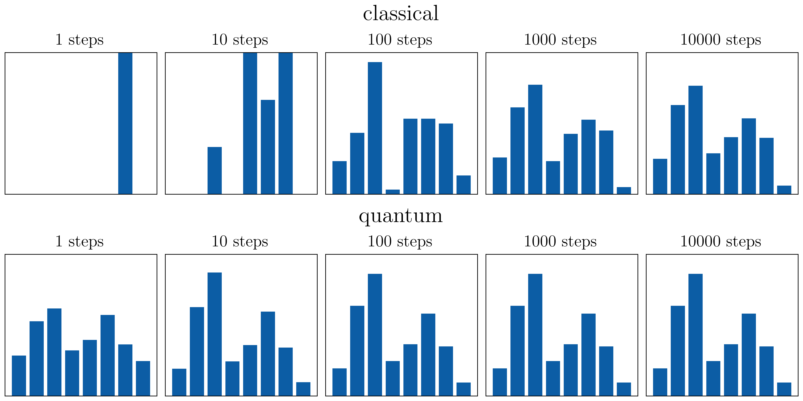
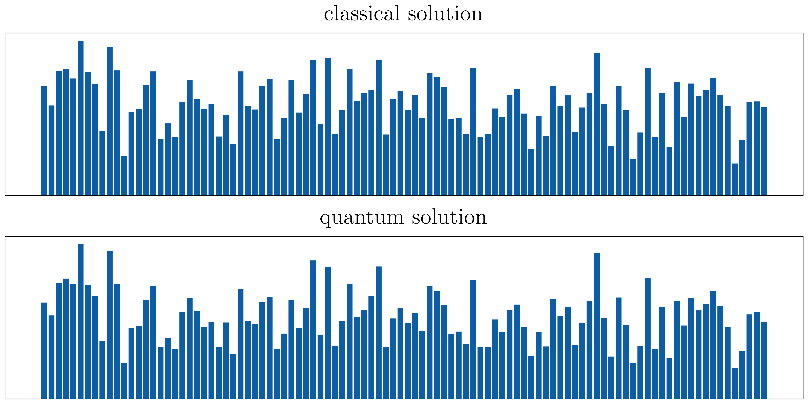

# Quantum Walk

Quantum Walk is a project to investigate the differences in how information is processed and distributed in quantum and classical systems.

### Quantum PageRank algorithm

A quantum version of the PageRank algorithm can be used on directed graphs.

Its speedup over the classical counterpart:

Its accuracy on large graphs:
